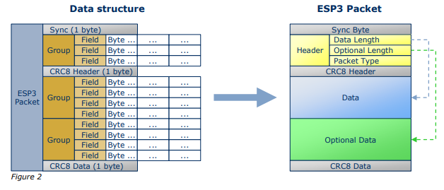

# Enocean Serial Protocol (ESP3)

* [Packet Structure](#packet-structure)
* [Packet Description](#packet-description)

## Packet structure
ESP3 is a Point-to-Point protocol with a packet data structure.
This principle encapsulates actual user data (payload), Command, Event or Response
messages.

Every ESP3 packet consists of Header, Data and Optional Data.

The packet (frame) is divided into: Sync.-Byte (start), CRC8 for Header and CRC8 for
Data (incl. Optional Data).

Every group consists of Fields, each with 1 or x bytes.

The ESP3 Header consists of the Fields:
- Data Length (number of bytes of the group Data)
- Optional Length (number of bytes of the group Optional Data)
- Packet Type (RADIO, RESPONSE, EVENT, COMMAND ...)

## Packet description

| Group | Offset | Size | Field | Value hex | Description |
| --- | --- | --- | --- | --- | --- |
| - | 0 | 1 | Sync. Byte | 0x55 | Serial synchronization byte;  always set to 0x55 |
| header | 1 | 2 | Data Lenth | 0xnnnn | Specifies how many bytes in DATA must be interpreted |
| header | 3 | 1 | Optional Length | 0xnn | Specifies how many bytes in OPTIONAL_DATA must be interpreted |
| header | 4 | 1 | <a id="packet-type">Packet type</a> | 0xnn | Specifies the packet type of DATA, respectively OPTIONAL_DATA |
| - | 5 | 1 | CRC8H | 0xnn | CRC8 Header byte; calculated checksum for bytes: DATA_LENGTH, OPTIONAL_LENGTH and TYPE |
| Data | 6 | x | ... | ... | Contains the actual data payload with topics:  <ul><li>RawData (e.g. 1:1 radio telegram)</li> <li>Function codes + optional parameters</li> <li>Return codes + optional parameters</li><li>Event codes</li> x = variable length of DATA / byte number |
  | Optional Data | 6 + x | y | ... | ... | Contains additional data that extends the field DATA;  y = variable length of OPTIONAL_DATA |
| - | 6 + x + y | 1 | CRC8D | 0xnn | CRC8 Data byte; calculated checksum for whole byte groups: DATA and OPTIONAL_DATA |

## Packet types

Depending on the field [Packet Type](#packet-type) a different kind of packet is transmitted.

| Type No. | Value hex | Name | Description |
| --- | --- | --- | --- |
| 0 | 0x00 | --- | Reserved |
| 1 | 0x01 | RADIO_ERP1 | Radio telegram |
| 2 | 0x02 | RESPONSE | Response to any packet |
| 3 | 0x03 | RADIO_SUB_TEL | Radio subtelegram |
| 4 | 0x04 | EVENT Event | message |
| 5 | 0x05 | COMMON_COMMAND | Common command |
| 6 | 0x06 | SMART_ACK_COMMAND | Smart Ack command |
| 7 | 0x07 | REMOTE_MAN_COMMAND | Remote management command |
| 8 | 0x08 | --- | Reserved for EnOcean |
| 9 | 0x09 | RADIO_MESSAGE | Radio message |
| 10 | 0x0A |  RADIO_ERP2 | ERP2 protocol radio telegram |
| 11 - 15 | 0x0A ... 0F  | --- | Reserved for EnOcean |
| 16 | 0x10 |  RADIO_802_15_4 | 802_15_4_RAW Packet |
| 17 | 0x11 |  COMMAND_2_4 | 2.4 GHz Command |
| 18 - 127 | 0x12 - 0x1F | ... | Reserved for EnOcean |
| 128 - 255 | 0x80 - FF | available | Manufacturer Specific Communication (MSC) and messages |
